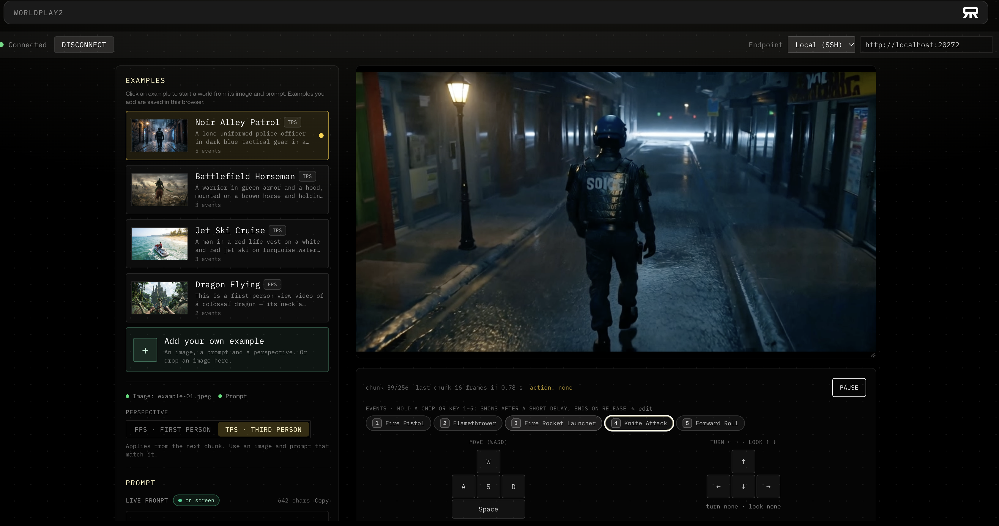
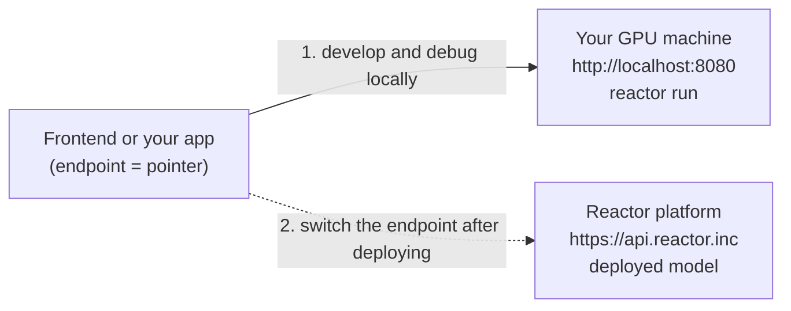

# WorldPlay2 on Reactor

Real-time, playable [WorldPlay2](https://github.com/WorldPlay2/WorldPlay2), powered by
[Reactor](https://reactor.inc). Upload an image of a scene, describe it, and walk through it
in real time: the model streams video chunk by chunk while you steer with movement and look controls.



What this integration adds to WorldPlay2:

- **It runs as a Reactor app.** WorldPlay2 is integrated with the [Reactor runtime](https://github.com/reactor-team/reactor-runtime), so the model is a
  service on your own GPU machine that any Reactor client can drive: the included frontend, or one you
  build.
- **It plays in real time.** It streams at a steady 17 frames per second on 4 B200 GPUs.
- **It deploys as an API.** Serve the same app on Reactor with the `reactor` CLI.

It takes two steps, and each one supports different work:

| Step | What you get | What it supports |
| --- | --- | --- |
| **1. Run it locally** (this README) | The model served on your own GPUs, with a local address any client can connect to | Playing it in the included frontend. Building your own frontend or app against it and debugging the app end to end. Debugging the model, benchmarking and evaluating it, all interactively, at the speed people will play it |
| **2. Serve it as an API** | The same model as a hosted API on Reactor, reachable from anywhere | Sharing a demo with anyone through a link. Shipping your app, or anything built on the model, to your users |

The client side does not change between the two: a frontend or app built against the local model
connects to the hosted API by switching its endpoint (the included frontend supports both through its
endpoint list). Deployment is enabled per account by the Reactor team: ask us in the [Reactor community Slack](https://join.slack.com/t/reactorcommunity/shared_invite/zt-491hb5jwj-9K4~yG58uSWLtGa03omd2Q).

## What you need

- A Linux machine with **4 NVIDIA B200 GPUs**, Docker and the
  [NVIDIA Container Toolkit](https://docs.nvidia.com/datacenter/cloud-native/container-toolkit/latest/install-guide.html).
- About 82 GB of disk for the weights, plus room for the Docker image.
- Python 3 (for the Hugging Face download tool).
- On the machine where you open the browser: this repository, Node.js 20+ and [pnpm](https://pnpm.io/installation).

Run the following commands from the `reactor/` directory:

```sh
cd reactor
```

## 1. Install the reactor CLI

```sh
# macOS or Linux, with Homebrew (keep it current with: reactor upgrade)
brew install reactor-team/tools/reactor-cli

# Linux without Homebrew (ARCH=amd64 or arm64), into ~/.local/bin
ARCH=amd64
mkdir -p ~/.local/bin
curl -fsSL "https://releases.reactor.inc/reactor-cli/latest/reactor-cli_linux-${ARCH}.tar.gz" \
  | tar -xz -C ~/.local/bin
export PATH="$HOME/.local/bin:$PATH"
```

**Check:** `reactor version` prints a version.

## 2. Get the weights

The base files come from the public [Wan2.2-I2V-A14B](https://huggingface.co/Wan-AI/Wan2.2-I2V-A14B)
repository (about 12 GB; only the files below, not its expert shards):

```sh
python3 -m venv .venv && . .venv/bin/activate
pip install -U "huggingface_hub[cli]"
hf download Wan-AI/Wan2.2-I2V-A14B \
  --include "models_t5_umt5-xxl-enc-bf16.pth" \
  --include "Wan2.1_VAE.pth" \
  --include "google/umt5-xxl/*" \
  --include "high_noise_model/config.json" \
  --include "low_noise_model/config.json" \
  --local-dir ./weights/base
```

The two expert files (34.9 GB each) are the few-step (autoregressive, 4-step) WorldPlay2 model,
published by the WorldPlay2 team as
[WorldPlay2-Fast](https://huggingface.co/aejion/WorldPlay2-Fast) on Hugging Face:

```sh
hf download aejion/WorldPlay2-Fast \
  --include "high_noise_model/diffusion_pytorch_model.safetensors" \
  --include "low_noise_model/diffusion_pytorch_model.safetensors" \
  --local-dir ./weights/fast
```

The two files must end up at exactly these paths:

```text
weights/fast/high_noise_model/diffusion_pytorch_model.safetensors
weights/fast/low_noise_model/diffusion_pytorch_model.safetensors
```

**Check:** `find weights -type f -not -path '*/.cache/*' | wc -l` prints `10`, and
`du -sh --si weights` prints about `82G`.

## 3. Start the model

```sh
reactor run --gpus all --port 8080
```

The first start builds the Docker image, then loads about 82 GB of weights onto the 4 GPUs and
warms up, which takes about a minute on 4 B200s once the weights are in the file cache. Leave it running in this terminal; `Ctrl+C`
stops it. On a shared machine, pin 4 free GPUs instead of `all`: `--gpus '"device=0,1,2,3"'`.

**Check:** in another terminal, `curl -s localhost:8080/health` reports `"state":"available"`. Until then it
reports `"state":"loading"`. If the model stops after an error, stop `reactor run` and start it again:
reconnecting the client alone does not restart it.

## 4. Open the client

On the machine with your browser:

```sh
cd demo && cp .env.example .env && pnpm install && pnpm dev
```

Open http://localhost:3000 and pick the **Local** endpoint. If the model runs on another machine,
edit that endpoint's URL in the page to `http://<gpu-host>:8080` (or add an entry in
`reactor/demo/endpoints.local.json`, see [demo/README.md](demo/README.md)). The browser must reach the GPU host
over WebRTC: forwarding only the HTTP port through SSH does not carry the video. For SSH-only
access, also configure a TURN-over-TCP relay and forward its TCP port.

Click **Connect**, then pick an example from the gallery (each comes with its image and prompt)
or add your own image and prompt to start playing. Hold **WASD** to move, the **arrow keys** to look
around, or **Space** for the space action. Release the keys or on-screen buttons to stop the corresponding action.

**Check:** video appears and responds to the controls.

This frontend is one example application, built on Reactor's JavaScript SDK. You can build your own
in other languages too.

<details>
<summary><b>Build your own app with the Reactor SDKs</b> (JavaScript, Python, C++, Swift, Java)</summary>

Once the model is running, locally or as an API, an app reaches it through a Reactor SDK: it opens a
session, sends commands (an image, a prompt, movement), and receives the video and events. Every SDK
connects to a local model as well as a hosted one, so you can build and debug an app on your own
machine and point the same code at the API later.

| SDK | Install | Suited to |
| --- | --- | --- |
| JavaScript / React | `npm install @reactor-team/js-sdk` | Browser apps. The included frontend is built on it |
| Python | `pip install reactor-sdk` | Scripts, servers, evaluation and computer-vision pipelines (frames arrive as NumPy arrays) |
| C++ | prebuilt archive, CMake `find_package(reactor-sdk)` | Native apps: engines, capture pipelines, desktop clients |
| Swift | SwiftPM package | macOS and iOS apps |
| Java | Java 22+ library | JVM applications |

See [Using the SDK](https://docs.reactor.inc/sdk-reference/using-the-sdk) for each one, and this
model's commands in [`worldplay2_types.py`](worldplay2_types.py) or its served schema
(`GET /schema` on the running model).

</details>

The frontend's endpoint is a pointer to wherever the model runs. Debug against your own machine,
then switch the pointer to the API once the model is deployed; nothing else in the client changes:



**The same frontend reaches the model once it is deployed.** Put your Reactor
API key in `reactor/demo/.env` as `REACTOR_API_KEY`, add a hosted **Reactor** endpoint
(`https://api.reactor.inc`, `apiKeyEnv: "REACTOR_API_KEY"`) in `reactor/demo/endpoints.local.json`, and select it:
the page then plays the model served on the Reactor platform instead of
the one on your machine. The key stays on the frontend's server, which exchanges it for a short-lived
session token; the browser never sees it. If your model is deployed under a name other than
`worldplay2` (for example `<org>/worldplay2`), set `modelName` on that endpoint in
`reactor/demo/endpoints.local.json` (see [demo/README.md](demo/README.md)).

## Controls

Choose first-person (`fps`) or third-person (`tps`), pick an image, write a prompt that describes the
scene (the examples come with one), then start a fresh world.

| Control | Effect |
| --- | --- |
| Image | Start a new world from a PNG, JPEG or WebP and its prompt. |
| Prompt | Change the text for upcoming video, keeping the current world. |
| Movement, turn, look, Space | Hold the keyboard keys or on-screen buttons; release them to stop the corresponding action. |
| Perspective | Switch between first- and third-person controls. |
| Yaw / pitch degrees | Turning and looking speed. |
| Reset | Restart the same image with a seed, keeping prompt and controls. |

Prompts take the form `The scene in the video is: ...`; third-person prompts add
`The character is: ...`, and `The event is: ...` when needed. Changes apply after the video already
buffered. A world ends after 256 chunks, the model's limit; reset or pick an image to continue.

## More

- **Upstream code:** the [official WorldPlay2 code](https://github.com/WorldPlay2/WorldPlay2).
- **Deploy:** see the [Reactor platform docs](https://docs.reactor.inc/deploy) for publishing and deploying with the `reactor` CLI.
- **Code map:** `worldplay2_app.py` (client commands and session), `worldplay2_model.py`
  (model and settings), `worldplay2_types.py` (controls and messages), `acceleration/` (runtime
  code), `inference/` (streaming and optimized model extensions), `worldplay2.yaml` (settings),
  `demo/` (client). These live under `reactor/`, along with `reactor.yaml` and the build configuration.
  The image fetches a pinned official WorldPlay2 revision for the shared `worldplay2/` and `configs/`
  packages, then loads the local Reactor adapter. Updating that upstream dependency means changing
  its commit in `reactor.yaml`; edits to the repository's sibling packages are not included in this build.

## Where this is going

We want Reactor to power real-time, interactive models like WorldPlay2: running them on your own GPUs
while you build, and serving them to anyone once you ship. This integration is one step in that
direction.

If you have suggestions for the Reactor runtime or the Reactor platform, or something here got in your
way, we would like to hear it: open an issue on the
[Reactor runtime repository](https://github.com/reactor-team/reactor-runtime/issues) or in this one, or
talk to us in the [Reactor community Slack](https://join.slack.com/t/reactorcommunity/shared_invite/zt-491hb5jwj-9K4~yG58uSWLtGa03omd2Q).

## Credits

Thanks to [Rising0321](https://github.com/Rising0321), [Orion-Zheng](https://github.com/Orion-Zheng), and [notrealzapa](https://github.com/notrealzapa) for porting WorldPlay2 to Reactor and optimizing the inference infrastructure.

## Licence

The Reactor integration retains the team's [LICENSE](LICENSE) and [NOTICE](NOTICE).
The upstream WorldPlay2 release declares CC-BY-NC-4.0 in [LICENSE.txt](../LICENSE.txt);
its code remains subject to that licence. Files derived from Wan2.2 keep the Alibaba Wan Team
copyright notices. The weights are under the licences of their Hugging Face repositories.
